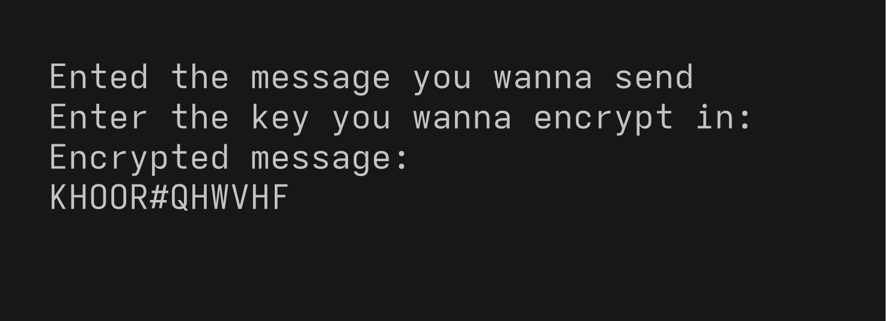
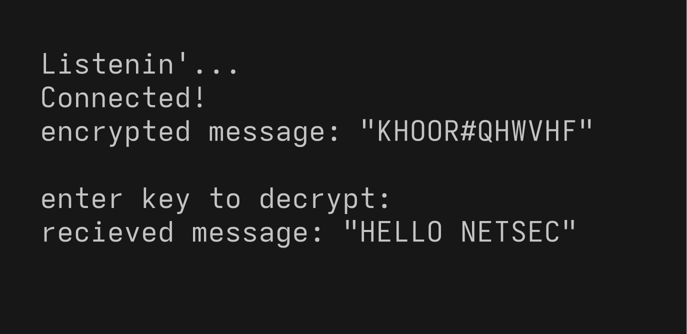
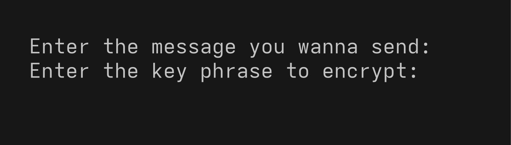
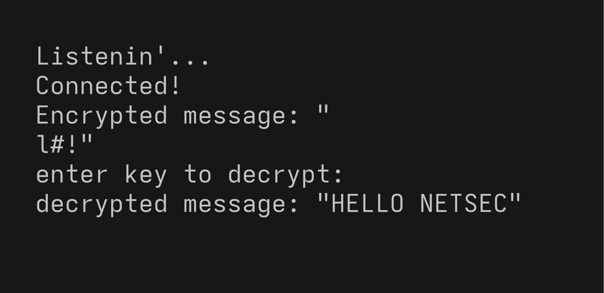
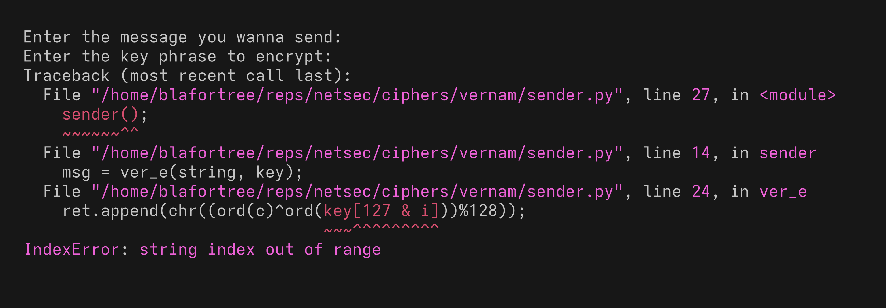
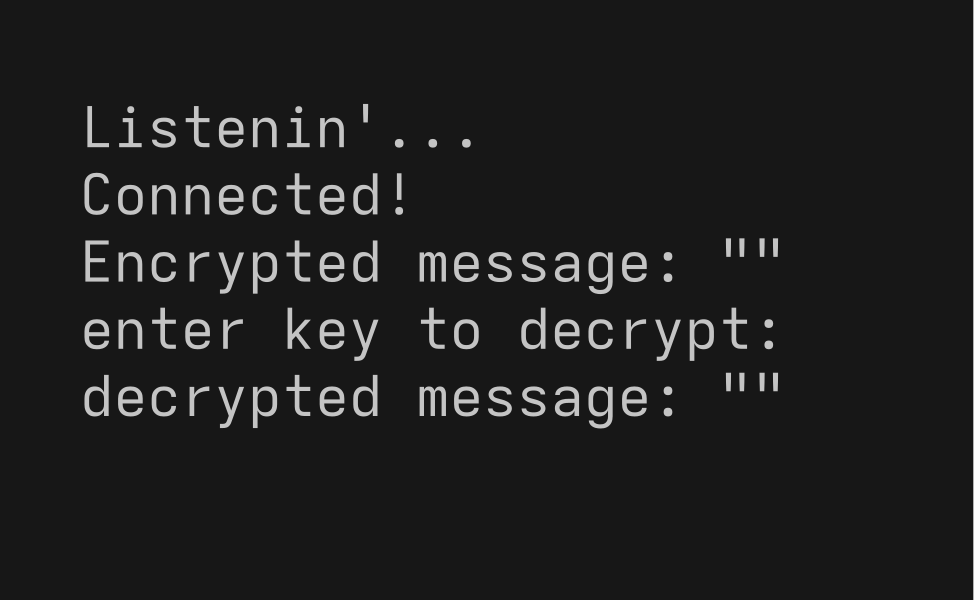

# Cryptography and Network Security Lab
**Name:** Nithish Siva Kumar  
**Reg No:** 23BCE1230  
**Course Code:** BCSE309P  
**Faculty:** Prof. Karthika V

# EX1A

## Caesar Cipher

### Sender
```python
import socket;

def sender():
    s = socket.socket(socket.AF_INET, socket.SOCK_STREAM);

    try:
        s.connect(("localhost", 42069));
    except ConnectionRefusedError:
        print("Hey the passwords are stored in plaintext");
        return;
    print("Ented the message you wanna send ");
    msd = input();
    print("Enter the key you wanna encrypt in: ");
    key = int(input());
    msd = caesae_e(msd, key);
    print(f"Encrypted message:\n{msd}");
    s.send(msd.encode(encoding="ascii", errors="ignore"));

    s.close();

def caesae_e(inp, key):
    ret = [];
    for c in inp:
        ret.append(chr((ord(c)+key)%128));
        
    return "".join(ret);
sender();

```
### Receiver
```python
import socket

def reciever():
    reci = socket.socket(socket.AF_INET, socket.SOCK_STREAM);

    reci.bind(("localhost", 42069));
    reci.listen(1);
    print("Listenin'...");
    conn, addr = reci.accept();
    print("Connected!");

    payload = conn.recv(1024).decode("ascii");
    print(f"encrypted message: \"{payload}\"\n\nenter key to decrypt:");
    key = int(input());
    msd = caesar_d(payload, key);
    print(f"recieved message: \"{msd}\"");

    conn.close();
    reci.close();

def caesar_d(string, key):
    ret = [];
    for c in string:
        ret.append(chr((ord(c)-key)%128));

    return "".join(ret);
reciever();

```
### Output



## Vigenere Cipher

### Sender
```python
import socket;

def sender():
    s = socket.socket(socket.AF_INET, socket.SOCK_STREAM);
    try:
        s.connect(("localhost", 42069));
    except ConnectionRefusedError:
        print("toodles");
        return;
    print("Enter the message you wanna send: ");
    string = input();
    print("Enter the key phrase to encrypt: ");
    key  = input();
    msg = vig_e(string, key);
#   print(msg);
    s.send(msg.encode(encoding="ascii", errors="ignore"));
    s.close();

def vig_e(string, key):
    ret = [];
    n = len(string);
    m = len(key);

    for i in range(n):
        ret.append(chr((ord(string[i])+ord(key[i%m]))%128));
    return "".join(ret);

sender();

```
### Receiver
```python
import socket

def reciever(): #{
    r = socket.socket(socket.AF_INET, socket.SOCK_STREAM);
    r.bind(("localhost", 42069));
    r.listen(1);
    print("Listenin'...");
    conn, addr = r.accept();
    print("Connected!");

    pl = conn.recv(1024).decode("ascii");
    print(f"Encrypted message: \"{pl}\"\nenter key to decrypt:");
    key = input();
    msg = ver_d(pl, key);
    print(f"decrypted message: \"{msg}\"");
    conn.close();
    r.close();
#}
def ver_d(inp, key): #{
    ret = [];
    n = len(inp);
    m = len(key);

    for i, c in enumerate(inp): 
        ret.append(chr((ord(c)-ord(key[i%m]))%128));

    return "".join(ret);
#}
reciever();

```
### Output



## Vernam Cipher

### Sender
```python
import socket;

def sender():
    s = socket.socket(socket.AF_INET, socket.SOCK_STREAM);
    try:
        s.connect(("localhost", 42069));
    except ConnectionRefusedError:
        print("toodles");
        return;
    print("Enter the message you wanna send: ");
    string = input();
    print("Enter the key phrase to encrypt: ");
    key  = input();
    msg = ver_e(string, key);
    s.send(msg.encode(encoding="ascii", errors="ignore"));
    s.close();

def ver_e(string, key):
    ret = [];
    n = len(string);
    m = len(key);

    for i, c in enumerate(string):
        ret.append(chr((ord(c)^ord(key[127 & i]))%128));
    return "".join(ret);

sender();

```
### Receiver
```python
import socket

def reciever(): #{
    r = socket.socket(socket.AF_INET, socket.SOCK_STREAM);
    r.bind(("localhost", 42069));
    r.listen(1);
    print("Listenin'...");
    conn, addr = r.accept();
    print("Connected!");

    pl = conn.recv(1024).decode("ascii");
    print(f"Encrypted message: \"{pl}\"\nenter key to decrypt:");
    key = input();
    msg = ver_d(pl, key);
    print(f"decrypted message: \"{msg}\"");
    conn.close();
    r.close();
#}


def ver_d(string, key):
    ret = [];
    n = len(string);
    m = len(key);

    for i, c in enumerate(string):
        ret.append(chr((ord(c)^ord(key[127 & i]))%128));
    return "".join(ret);

reciever();

```
### Output


